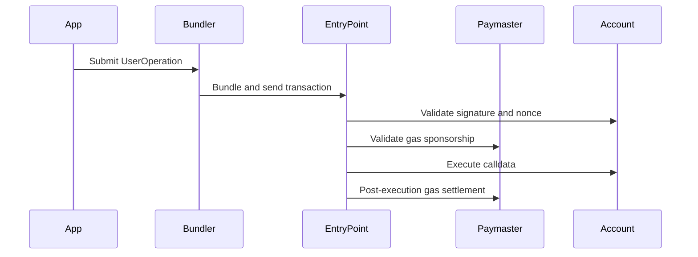

# Account Abstraction

Account Abstraction enables the use of smart contract accounts instead of traditional externally owned accounts (EOAs). It separates ownership from control: unlike EOAs where the private key is tightly coupled to the account, smart accounts abstract the account from the signer.

## The Problem with EOAs

- **Gas fees create onboarding barriers.** Users must hold ETH before they can do anything.
- **Common interactions require multiple transactions.** An approve-and-swap on Uniswap is two separate confirmations.
- **Security is fragile.** A single seed phrase controls everything with no recovery, no spending limits, and no way to revoke access.
- **Automation is impossible.** EOAs require a human to sign every transaction.

## ERC-4337: How It Works

[ERC-4337](https://eips.ethereum.org/EIPS/eip-4337) brings smart accounts to Ethereum without protocol changes. It introduces a parallel transaction flow built on these components:

| Component | Role |
|-----------|------|
| **Smart Account** | A contract that holds assets and defines its own validation logic |
| **UserOperation** | A data structure packaging the user's intent, gas details, and signature |
| **Bundler** | A node that collects UserOperations and submits them to the blockchain |
| **EntryPoint** | A singleton contract that verifies and executes each UserOperation |
| **Paymaster** | An optional contract that sponsors gas or accepts ERC-20 tokens as payment |

1. The app constructs a UserOperation and sends it to a Bundler
2. The Bundler bundles it with others and submits a transaction to the EntryPoint
3. The EntryPoint verifies the account's signature and confirms gas payment (from the account or a Paymaster)
4. The EntryPoint executes the account's calldata

## Next Steps

- [Send your first gasless transaction](/wallet/guides/getting-started/) to see this flow in practice
- Browse the [SDK Reference](/wallet/abstractionkit/introduction/) for the full API
- Read the [ERC-4337 specification](https://eips.ethereum.org/EIPS/eip-4337) for the complete standard
