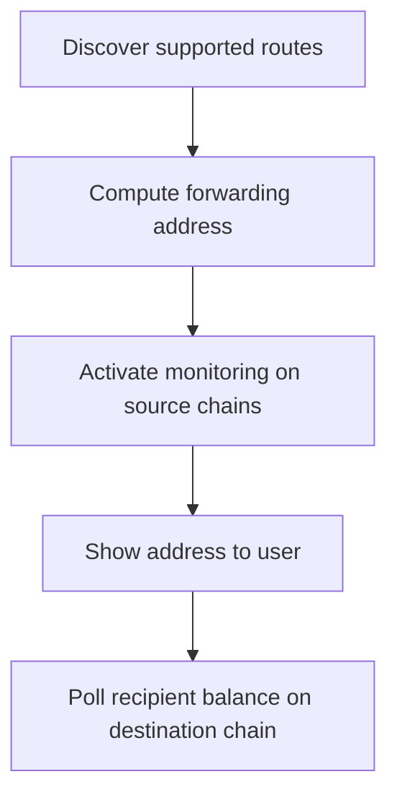

# Forwarding Address Integration Guide

:::caution Alpha
The Forwarding Address API is in alpha. Breaking changes are expected. Do not move large amounts of funds through forwarding addresses during the alpha period.
:::

## Typical Integration Flow

See the [API Reference](./forwarding-address-api.mdx) for details on each method. There is currently no webhook for forwarding completion. Poll the recipient's token balance on the destination chain to confirm arrival. Typical latency is 10 to 20 seconds.

---

## Keeping Addresses Alive

Monitoring is TTL-based. When the activation expires, the relayer stops watching for deposits. Before presenting a forwarding address to a user, check its activation status and call `forwarding_activate` again if the TTL has expired.

`forwarding_activate` is idempotent. Calling it again resets the TTL. If a deposit arrives after expiration, the funds sit in the forwarding address until either:

- The address is reactivated via `forwarding_activate`, at which point the relayer picks up the deposit
- The funds are recovered via the [recovery frontend](https://forwarding-address.candidelabs.com/)

---

## Multiple Addresses per Recipient

Use the optional `salt` parameter in `forwarding_getAddress` and `forwarding_activate` to generate distinct forwarding addresses for the same recipient and destination pair. Each unique salt produces a different deterministic address. This is useful for tracking individual deposits or creating per-transaction deposit addresses.

---

## The `custodialWithdrawer` Role

The `custodialWithdrawer` is a company-controlled secure wallet that acts as a safety net for stuck funds. If funds get stuck in a forwarding address (e.g. the relayer did not process them), both the `recipient` and the `custodialWithdrawer` can withdraw directly from the deployed contract on the source chain. The recipient can always withdraw immediately. The `custodialWithdrawer` can withdraw after a timelock.

This matters for every integration, not just custodial ones. If a user funds their forwarding address from an exchange or a wallet they don't control on the source chain, they may not be able to send a withdrawal transaction on that chain. Without a separate `custodialWithdrawer`, those funds are stuck permanently.

| Scenario | `recipient` | `custodialWithdrawer` | Outcome |
|----------|-------------|------------------------|----------|
| Wallet or dapp (recommended) | User's address | Company's secure wallet | Company can recover stuck funds on behalf of the user after a timelock. User can always withdraw immediately |
| Fully self-managed | User's address | Same as `recipient` | Only the user can recover stuck funds. If they cannot transact on the source chain, funds are unrecoverable |
| Custodial (exchanges, neobanks) | End-user's address | Company's secure wallet | Company can withdraw stuck funds on behalf of the user after a timelock |

:::caution
Setting `custodialWithdrawer` to the same address as `recipient` means only the recipient can recover stuck funds. If users fund the forwarding address from an exchange or any source they don't control, and funds get stuck, there is no fallback recovery path. For most integrations, set `custodialWithdrawer` to your company's secure wallet.
:::

### Withdrawal priority

- The `recipient` can always withdraw immediately from the deployed contract (no timelock)
- The `custodialWithdrawer` can withdraw after a timelock period, providing a recovery path when the recipient cannot transact on the source chain

### Fund recovery

If funds are stuck, use the [recovery frontend](https://forwarding-address.candidelabs.com/) to recover them.

---

## Gotchas

- Deposits below the per-bridge minimum are not forwarded. Query [`forwarding_getMinimumAmount`](./forwarding-address-api.mdx#forwarding_getminimumamount) for the route and token to validate user input, and display the minimum clearly in your UI.
- Only tokens listed in the route's `tokens` array are forwarded. Unsupported tokens sent to the address require manual recovery.
- The forwarding address accepts deposits on any supported chain, including the destination chain. Do not send on unsupported chains. Check `forwarding_getRoutes` for the full list of supported chains per route.
- The output token on the destination chain may have different decimals than the input token. Use the token's `decimals` from [`forwarding_getRoutes`](./forwarding-address-api.mdx#forwarding_getroutes) when formatting amounts.
- Cache `forwarding_getRoutes` on app load and refresh periodically. Routes, fees, and supported tokens can change.
