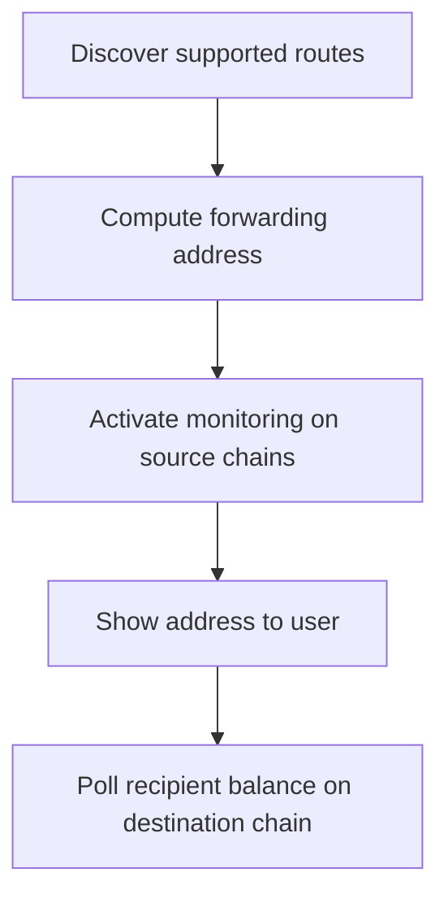

# Forwarding Address Integration Guide

:::caution Alpha
The Forwarding Address API is in alpha. Breaking changes are expected. Do not move large amounts of funds through forwarding addresses during the alpha period.
:::

## Typical Integration Flow

See the [API Reference](./forwarding-address-api.mdx) for details on each method. There is currently no webhook for forwarding completion. Poll the recipient's token balance on the destination chain to confirm arrival. Typical latency is 10 to 20 seconds.

---

## Keeping Addresses Alive

Monitoring is TTL-based. When the activation expires, the relayer stops watching for deposits. For long-lived deposit addresses (e.g. persistent exchange deposit addresses), set up a background job to call `forwarding_activate` before the TTL expires.

`forwarding_activate` is idempotent. Calling it again resets the TTL. If a deposit arrives after expiration, the funds sit in the forwarding address until either:

- The address is reactivated via `forwarding_activate`, at which point the relayer picks up the deposit
- The recipient or `custodialWithdrawer` deploys the contract and withdraws manually

---

## Multiple Addresses per Recipient

Use the optional `salt` parameter in `forwarding_getAddress` and `forwarding_activate` to generate distinct forwarding addresses for the same recipient and destination pair. Each unique salt produces a different deterministic address. This is useful for tracking individual deposits or creating per-transaction deposit addresses.

---

## The `custodialWithdrawer` Role

The `custodialWithdrawer` parameter enables a custodial recovery pattern for exchanges and managed wallets.

| Scenario | `recipient` | `custodialWithdrawer` | Behavior |
|----------|-------------|------------------------|----------|
| Non-custodial (wallets, dapps) | User's address | Same as `recipient` | User has sole control. No timelock needed |
| Custodial (exchanges, neobanks) | End-user's address | Platform's address | Platform can withdraw stuck funds on behalf of the user, subject to a timelock |

### Withdrawal priority

- The recipient can always withdraw immediately from the deployed contract (no timelock)
- The `custodialWithdrawer` can withdraw after a timelock period, providing a safety net when the recipient cannot send transactions (common for exchange users who do not control their keys directly)

### On-chain withdrawal (emergency recovery)

1. Ensure the contract is deployed on the source chain. Call [`forwarding_deploy`](./forwarding-address-api.mdx#forwarding_deploy) if needed, or the relayer auto-deploys on first deposit.
2. The recipient (or `custodialWithdrawer` after timelock) calls `withdraw(token, amount)` or `withdrawETH(amount)` directly on the forwarding address contract.

---

## Gotchas

- Deposits below `minAmount` from `forwarding_getRoutes` are not forwarded. Display minimums clearly in your UI.
- Only tokens listed in the route's `tokens` array are forwarded. Unsupported tokens sent to the address require manual recovery.
- Do not send to the forwarding address on the destination chain or on unsupported source chains. Funds will not be forwarded.
- The output token on the destination chain may have different decimals than the input token. Use the token's `decimals` from [`forwarding_getRoutes`](./forwarding-address-api.mdx#forwarding_getroutes) when formatting amounts.
- Cache `forwarding_getRoutes` on app load and refresh periodically. Routes, fees, and supported tokens can change.
