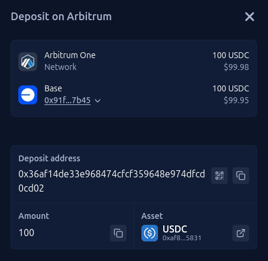

# The Unified Deposit Address: One Address for Every Chain

*A new concept for seamless cross-chain deposits. Send assets from any blockchain and instantly access them where you need them most.*

## The Cross-Chain Problem We All Face

The multi-chain world is booming. Assets, apps, and opportunities are spread across dozens of vibrant ecosystems like Ethereum, Base, Polygon, and Arbitrum. But moving between them is a major headache.

Today, sending yourself `USDC` from one chain to another involves:

  * Finding a trustworthy bridge.
  * Navigating a complex interface with multiple steps.
  * Paying gas fees on two different chains.
  * Waiting anxiously for 5-30 minutes, hoping nothing goes wrong.

This friction is a barrier for everyone, from crypto newcomers to seasoned veterans. It keeps the ecosystem fragmented and complicated.

## The Solution: A Deposit Address for Everything

Imagine having a deposit address that works everywhere. A unified address you can send assets to from any supported chain, with the funds appearing automatically on your primary chain moments later.

That’s the Unified Deposit Address.

**Here’s how it works:**

  * **Your Main Account:** You use Base for your daily activity.
  * **The Task:** You need to get 100 `USDC` from an Arbitrum wallet over to Base.
  * **The Action:** Instead of bridging, you simply send the 100 `USDC` from Arbitrum to your one Unified Deposit Address.
  * **The Result:** The system handles everything in the background. Moments later, 100 `USDC` is available in your Base wallet, ready to use.

### The Difference is Night and Day

| The Old Way (Manual Bridging) | The Unified Address (Simple) |
| :--- | :--- |
| 1. Find and vet a third-party bridge. | 1. Copy your one Unified Address. |
| 2. Connect your wallet. | 2. Send assets to it from any chain. |
| 3. Approve and confirm multiple transactions. | 3. Done. Funds appear on your main chain. |
| 4. Pay gas fees on both chains. | |
| 5. Wait 5-30 minutes for funds to arrive. | |

### Key Benefits

  * **Zero Complexity:** Forget bridges, RPCs, and chain-switching. Just send your assets and you're done. The complex routing is completely abstracted away.
  * **Instant Access:** Your funds arrive on your main chain in moments, not long, unpredictable minutes.
  * **One Address for Everything:** Finally, a single, persistent address you can give to anyone or use yourself to consolidate funds from across the EVM ecosystem.
  * **Always Optimal:** The system automatically finds the best and most efficient route for your assets behind the scenes.
  * **Universal Onboarding:** This makes it trivial for anyone, regardless of which blockchain they currently use, to start interacting with a new ecosystem seamlessly.

This is more than just a feature; it's a vision for how crypto should work—simple, intuitive, and truly interoperable. By removing the core friction of moving between chains, we can unlock the full potential of the multi-chain world for everyone.
