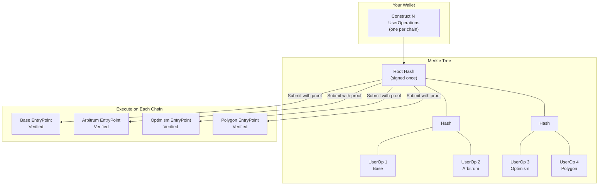

# Safe Unified Account: One Signature, Every Chain

*Execute coordinated operations across all your chains with a single signature, unlocking seamless account sync and compatibility with Ethereum's Interoperability Layer.*

## The Multichain Problem

You manage a Safe on Base, another on Arbitrum, a third on Optimism, and maybe a fourth on Polygon. This is increasingly common as Ethereum scales through L2s, with the ecosystem now spanning over 55 rollups and that number continuing to grow.

Now imagine you need to replace a compromised signer key, add a recovery guardian, or update your multisig threshold from 2-of-3 to 3-of-5. Today, that means four separate signing sessions, four gas payments, four opportunities for human error, and four chances to forget one chain and leave it misconfigured. This doesn't scale. As users spread across more L2s, managing account configuration becomes a coordination nightmare, and inconsistent configurations create security risks where a forgotten chain with outdated owners becomes a vulnerability waiting to be exploited.

The Ethereum Foundation frames this as the fragmentation problem: L2s have made Ethereum scalable, but they've also made it feel like dozens of disconnected networks. Their response is the [Ethereum Interoperability Layer (EIL)](https://blog.ethereum.org/2025/11/18/eil), a vision for making Ethereum "feel like one chain again." We want multichain Safes to feel like one account, and that's what Safe Unified Account delivers.

## The Solution: Sign Once, Execute Everywhere

Safe Unified Account is a Safe module that enables multichain batch signatures. Instead of signing N times for N chains, you sign once, and that single signature authorizes execution across every chain you target.

The mechanism is straightforward. You construct a UserOperation for each chain you want to execute on, hash each operation, and arrange them into a Merkle tree. You then sign the Merkle root once with your Safe owners and submit each UserOperation to its respective chain's bundler along with the Merkle proof. Each chain independently verifies the signature against the Merkle root using the proof, requiring no trusted bridges or centralized relayers. The verification is pure cryptography.

## EIL: Trustless Cross-Chain Token Movements

The Ethereum Foundation's [Interoperability Layer](https://blog.ethereum.org/2025/11/18/eil) represents the most significant shift in how cross-chain transactions will work. EIL enables trustless token transfers between L2s without bridges, custodians, or trust assumptions beyond Ethereum itself. For a broader overview of EIL and what it means for wallets, see our [EIL overview](/account-abstraction/research/eil).

The core insight is that cross-chain transfers can be reduced to coordinated operations on multiple chains, all verified by a single signature. The [EIL specification](https://ethresear.ch/t/eil-trust-minimized-cross-l2-interop/23437) describes the approach:

> "Users generate multiple UserOps across chains, then sign a single authorization on a Merkle root of all of them. Each chain validates via Merkle branch proofs."

Safe Unified Account implements exactly this signature scheme. When EIL launches on mainnet, Safe accounts with this module will be ready to participate in trustless cross-chain operations from day one.

### How EIL Transfers Work

Consider a concrete example where you want to move USDC from Arbitrum to Base. With EIL, you don't send tokens through a bridge. Instead, you sign a Merkle root that commits to two operations: a "send" on Arbitrum and a "receive" on Base.

Trustless liquidity providers, called XLPs in the EIL design, observe your signed intent. An XLP who has USDC on Base can fulfill your request by releasing funds to you on Base, and in return, they claim your funds on Arbitrum. The swap is atomic and cryptographically enforced. The XLP never custodies your funds, never sees your transaction details, and cannot censor or front-run you.

This model inverts the traditional bridge architecture. Instead of trusting a bridge operator to move your funds, your wallet and contract execute directly under verifiable rules. The EIL design describes it this way:

> "Transacting across L2s should be as trustless as using a DEX. EIL moves the logic onchain and into the user's wallet, removing dependence on intermediaries and opaque server logic."

### Beyond Simple Transfers

EIL's power extends beyond moving tokens from one chain to another. The same primitive supports complex cross-chain flows where operations have dependencies. Your wallet can orchestrate a sequence where you swap tokens on Arbitrum, move the proceeds to Optimism, and deposit into a protocol there. Each step can depend on the previous one, and the entire flow is authorized by a single Merkle-rooted signature.

The EIL specification describes these as "dependency graphs" where sometimes operations can run in parallel when there's no dependency, and sometimes there's a strict sequence where one UserOperation uses the proceeds from another. Safe Unified Account provides the signature infrastructure that makes this possible.

## Multichain Account Sync

While EIL enables trustless token movements, the same signature primitive solves a more immediate problem: keeping your Safe configuration consistent across chains.

The challenge starts at onboarding. When a user creates a wallet, they often want the same Safe on multiple chains with identical configuration. Today that requires separate deployments, separate owner setups, and separate module activations on each chain. Users drop off during this process, and those who complete it often end up with inconsistent configurations. A wallet provider could instead offer "create your Safe on Base, Arbitrum, and Optimism" as a single onboarding flow where one signature authorizes the full multichain setup.

When a team member leaves or a key is compromised, you can replace the owner on all chains with a single signature instead of racing to update each chain before an attacker exploits the delay. The operation is atomic in intent, meaning every chain gets the same update authorized by the same signature. Similarly, if you want to set up the [Social Recovery Module](/wallet/plugins/recovery-with-guardians) on all your chains, you can configure guardians once and deploy that configuration everywhere rather than performing a separate operation per chain. When your organization grows from 3 signers to 7 and you want to move from 2-of-3 to 4-of-7, one signature updates the policy across your entire multichain footprint.

Account recovery deserves special attention here. Recovery configuration is critical, but it's also easy to forget on chains you use less frequently. You might set up guardians on your main chain, then six months later deploy a Safe on a new L2 and forget to configure recovery. With Safe Unified Account, you can ensure consistent recovery options across your entire multichain footprint, eliminating security gaps from forgotten configurations.

## How It Works

### The Signature Scheme

Safe Unified Account extends the standard Safe 4337 module with a second signature mode:

| Mode | When Used | What's Signed |
|------|-----------|---------------|
| **Single-chain** | Standard operations on one chain | The UserOperation hash (chain-specific) |
| **Multichain** | Coordinated operations across chains | The Merkle root of multiple UserOperation hashes |

For multichain mode, the signature uses a chain-agnostic domain separator. This is crucial because the same signature must verify on Base, Arbitrum, Optimism, and any other target chain. By excluding `chainId` from the domain separator for the Merkle root, we enable cross-chain verification without requiring chain-specific signatures. Each individual UserOperation still includes chain-specific data since the operation itself is bound to a particular chain, but the Merkle root simply commits to the set of operations you're authorizing.

### Security Properties

Each chain independently verifies the signature without any central coordinator, bridge operator, or relayer that you need to trust. If you trust Ethereum's L2s today, you can trust this module.

Your existing Safe multisig policy applies unchanged. If you require 3-of-5 signatures for operations, you need 3-of-5 signatures on the Merkle root. The module doesn't bypass your security model but rather extends it to work across chains. Replay protection is handled by each chain's EntryPoint nonce, preventing you from replaying an operation or submitting the same batch twice.

If execution fails on one chain due to insufficient gas or unexpected state, the other chains are unaffected. There's no atomicity across chains since each chain executes independently. This is intentional because you don't want a failure on Polygon to block your owner replacement on Base. The module also supports contract signatures, so multisig guardians that are themselves Smart Accounts can participate in signing the Merkle root.

## The Difference

| Action | Today | With Safe Unified Account |
|--------|-------|---------------------------|
| Replace owner on 5 chains | 5 signing sessions, 5 transactions | 1 signature, 5 transactions |
| Add guardian on 5 chains | 5 signing sessions, 5 transactions | 1 signature, 5 transactions |
| Update threshold on 5 chains | 5 signing sessions, 5 transactions | 1 signature, 5 transactions |
| Cross-chain token transfer | Trust a bridge or custodian | Trustless via EIL |

The transactions still execute separately on each chain since that's unavoidable, but the cognitive overhead, the signing ceremonies, and the coordination burden all collapse to a single action.

## Current Status

| Phase | Status |
|-------|--------|
| Module development | Complete |
| Community feedback | Current |
| AbstractionKit integration | Current |
| Security audit | Planned |
| Mainnet launch | After testnet validation |

The module is feature complete. Before we proceed to audit, we want to validate that this solves real problems for real developers.

## Build With Us

We're looking for teams who want to integrate multichain signature support into their products and are willing to start building before the audit completes. If you're working on a wallet, treasury management tool, or any application where users manage Safe accounts across multiple chains, we want to talk.

Early partners will get access to the module code, direct integration support, and the opportunity to shape the final design based on real implementation feedback. In return, we're looking for teams who can commit engineering resources and provide concrete input on how the module fits their use case.

Reach out directly on Telegram: **[@heymarcopolo](https://t.me/heymarcopolo)**

Once you message us, we'll get you set up with the SDK and work with your team to complete an MVP integration within days, not weeks. If you're still evaluating whether this fits your roadmap, we're happy to walk through the technical details first.

---

*Technical questions? Reach out on [Discord](https://discord.gg/MfbK7aNWsY) or [GitHub](https://github.com/candidelabs)*.
