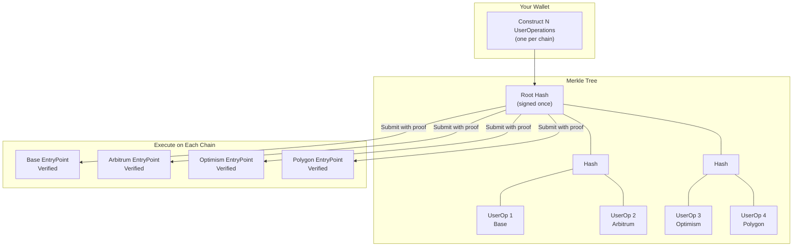

# Chain Abstraction with Safe Unified Account

*Execute coordinated operations across all your chains with a single signature, unlocking seamless account sync.*

## Demo

Try the live demo at **[unified.candide.dev](https://unified.candide.dev)**

## What is Chain Abstraction?

Chain abstraction removes the complexity of managing accounts across multiple chains. Instead of treating each deployment as a separate account that requires its own signing sessions and gas payments, chain abstraction lets you operate across all chains as if they were one. This works across any EVM chain where Safe is deployed: L2 rollups, sidechains like Gnosis Chain, and other L1s.

Safe Unified Account is a Safe module that implements chain abstraction through multichain batch signatures. You construct a UserOperation for each chain, arrange them into a Merkle tree, sign the Merkle root once, and submit each operation to its respective chain with a Merkle proof. Each chain independently verifies the signature. No trusted bridges, no centralized relayers. Pure cryptography.

## Why Chain Abstraction Matters

You manage a Safe on Base, another on Arbitrum, a third on Gnosis Chain, and maybe a fourth on Polygon. This is increasingly common as the EVM ecosystem grows across rollups, sidechains, and multiple L1s.

Now imagine you need to replace a compromised signer key, add a recovery guardian, or update your multisig threshold from 2-of-3 to 3-of-5. Today, that means four separate signing sessions, four gas payments, four opportunities for human error, and four chances to forget one chain and leave it misconfigured. Inconsistent configurations create security risks where a forgotten chain with outdated owners becomes a vulnerability.

| Action | Without Chain Abstraction | With Safe Unified Account |
|--------|---------------------------|---------------------------|
| Replace owner on 5 chains | 5 signing sessions, 5 transactions | 1 signature, 5 transactions |
| Add guardian on 5 chains | 5 signing sessions, 5 transactions | 1 signature, 5 transactions |
| Update threshold on 5 chains | 5 signing sessions, 5 transactions | 1 signature, 5 transactions |
The transactions still execute separately on each chain, but the cognitive overhead, the signing ceremonies, and the coordination burden all collapse to a single action.

## Use Cases

### Multichain Account Sync

Keep your Safe configuration consistent across chains. When a team member leaves or a key is compromised, replace the owner on all chains with a single signature instead of racing to update each chain before an attacker exploits the delay.

This applies to any configuration change: setting up the [Social Recovery Module](/wallet/plugins/recovery-with-guardians) on all chains at once, updating multisig thresholds across your entire footprint, or ensuring consistent recovery options so no chain is left with outdated security settings.

## How It Works

### The Signature Scheme

Safe Unified Account extends the standard Safe 4337 module with a second signature mode:

| Mode | When Used | What's Signed |
|------|-----------|---------------|
| **Single-chain** | Standard operations on one chain | The UserOperation hash (chain-specific) |
| **Multichain** | Coordinated operations across chains | The Merkle root of multiple UserOperation hashes |

For multichain mode, the signature uses a chain-agnostic domain separator. This is crucial because the same signature must verify on Base, Arbitrum, Optimism, and any other target chain. Each individual UserOperation still includes chain-specific data, but the Merkle root commits to the full set of operations you're authorizing.

### Security Properties

- **No trusted third parties.** Each chain independently verifies the signature without any central coordinator, bridge operator, or relayer.
- **Existing multisig policy applies.** If you require 3-of-5 signatures, you need 3-of-5 on the Merkle root. The module extends your security model, not bypasses it.
- **Replay protection.** Each chain's EntryPoint nonce prevents double-execution.
- **Independent execution.** If one chain fails (insufficient gas, unexpected state), the others are unaffected. A failure on Polygon does not block your owner replacement on Base.
- **Contract signature support.** Multisig guardians that are themselves Smart Accounts can participate in signing.

## Audits

The Safe Unified Account module has been audited by NM Audit:

- [Audit Report (NM-0874)](https://github.com/candidelabs/safe-4337-multi-chain-signature-module/blob/main/audit/NM_0874_Candide_safe.pdf)

To learn more about the contracts, visit the [Safe 4337 Multi-Chain Signature Module repository](https://github.com/candidelabs/safe-4337-multi-chain-signature-module).

## Examples

| Example | Description | Code |
|---------|-------------|------|
| Add Owner | Add an owner across chains with one signature | [add-owner.ts](https://github.com/candidelabs/abstractionkit-examples/blob/main/chain-abstraction/add-owner.ts) |
| Add Guardian | Sync recovery guardians across chains | [add-guardian.ts](https://github.com/candidelabs/abstractionkit-examples/blob/main/chain-abstraction/add-guardian.ts) |
| Passkey Signing | Use WebAuthn/passkeys for multichain signing | [add-owner-passkey.ts](https://github.com/candidelabs/abstractionkit-examples/blob/main/chain-abstraction/add-owner-passkey.ts) |
| EIP-712 Signing | Wallet-compatible signing for browser and hardware wallets | [add-owner-eip712-signed.ts](https://github.com/candidelabs/abstractionkit-examples/blob/main/chain-abstraction/add-owner-eip712-signed.ts) |

## Get Started

Follow the [Getting Started guide](/wallet/guides/chain-abstraction-getting-started) to add an owner across multiple chains with a single signature.

For the full SDK method reference, see [Safe Unified Account SDK Reference](/wallet/abstractionkit/safe-unified-account).

---

*Technical questions? Reach out on [Discord](https://discord.gg/MfbK7aNWsY) or [GitHub](https://github.com/candidelabs)*.
