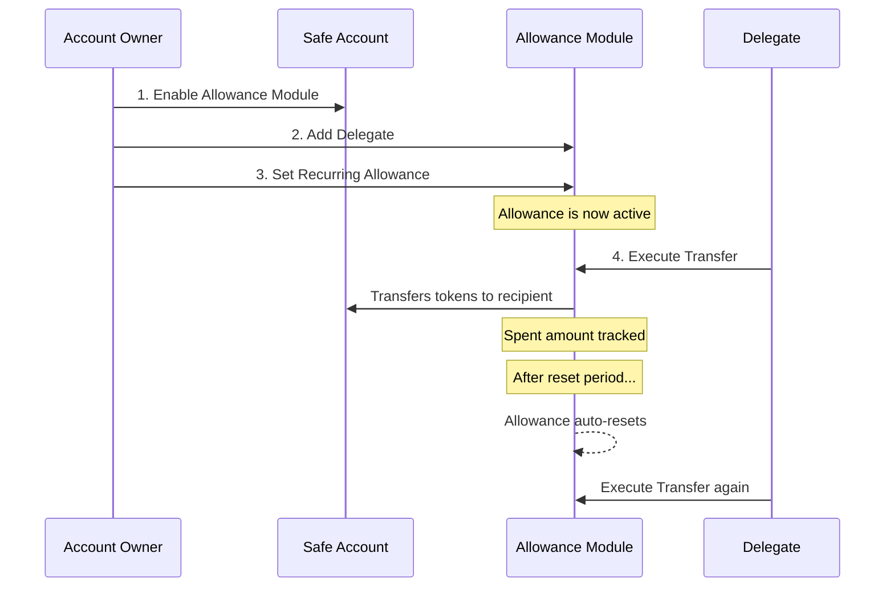

import Tabs from "@theme/Tabs";
import TabItem from "@theme/TabItem";

# How to Enable Spend Permissions with the Allowance Module

The Safe Allowance Module lets account owners delegate specific token spending rights to other accounts or contracts. Unlike standard ERC-20 approvals, this module enforces on-chain limits per delegate: one-time budgets, recurring allowances that auto-reset, and expiration controls.

## What You'll Build

By the end of this guide, you'll have:
- Enabled the Allowance Module on a Safe Account
- Added a delegate with permission to spend tokens
- Configured a recurring allowance with auto-reset
- Executed a delegated token transfer from the delegate's account

## Prerequisites

Before starting, make sure you have:

- **Node.js 18+** and npm or yarn
- **Basic TypeScript knowledge**
- **A funded Safe Account** with ERC-20 tokens on your target chain
- **Familiarity with Safe Smart Accounts** and UserOperations. See the [Getting Started guide](/wallet/guides/getting-started) if you're new

:::warning Delegate Trust
Delegates have full control over the allowance you grant them, up to the configured amount and frequency. Only delegate to addresses you trust. In production, consider using smart contracts as delegates to enforce additional conditions on transfers.
:::

## How It Works



## Use Cases

**Recurring Transfers**: Automate periodic transactions. Users define the amount, frequency, duration, and recipients. See [createRecurringAllowanceMetaTransaction](/wallet/plugins/allowance-reference#createrecurringallowancemetatransaction).

**Subscriptions**: Set up automatic payments for subscriptions, utility bills, or membership fees. Combine with a delegate contract that enforces payment schedules.

**Dollar-Cost Averaging (DCA)**: Delegate allowances to swap contracts that execute periodic buys. See [createOneTimeAllowanceMetaTransaction](/wallet/plugins/allowance-reference#createonetimeallowancemetatransaction) for single-use budgets.

**Custom Use Cases**: Delegate to smart contracts for application-specific needs. Use [createAllowanceTransferMetaTransaction](/wallet/plugins/allowance-reference#createallowancetransfermetatransaction) to execute transfers.

## Audits

- [Ackee Audit 2024](https://github.com/safe-global/safe-modules/blob/main/modules/allowances/docs/ackee-blockchain-safe-allowance-module-report.pdf)
- [GnosisSafe Audit 2020](https://github.com/safe-global/safe-modules/blob/main/modules/allowances/docs/AllowanceModuleAuditOct2020.md)

## Guide

### Install

<Tabs>
<TabItem value="npm" label="npm">

```bash title="terminal"
npm i abstractionkit
```

</TabItem>
<TabItem value="yarn" label="yarn">

```bash title="terminal"
yarn add abstractionkit
```

</TabItem>
</Tabs>

### Step 1: Initialize the Module

```ts
import { AllowanceModule } from "abstractionkit";

const allowanceModule = new AllowanceModule();
```

### Step 2: Enable the Module on Your Safe

The module must be enabled before any allowance operations. This only needs to happen once per Safe Account.

```ts
const enableModuleMetaTx = allowanceModule.createEnableModuleMetaTransaction(
  sourceSafeAccount.accountAddress, // your Safe account address
);
```

### Step 3: Add a Delegate

Register the address that will be allowed to spend tokens on behalf of the Safe.

```ts
const addDelegateMetaTx = allowanceModule.createAddDelegateMetaTransaction(
  delegateAddress, // address of the delegate
);
```

### Step 4: Set an Allowance

Configure how much the delegate can spend and how often the allowance resets.

**Recurring allowance** (resets automatically):

```ts
const setAllowanceMetaTx = allowanceModule.createRecurringAllowanceMetaTransaction(
  delegateAddress,    // delegate address
  tokenAddress,       // ERC-20 token address
  1n,                 // amount per period
  3n,                 // reset period in minutes
  0n,                 // start delay in minutes (0 = immediate)
);
```

**One-time allowance** (does not reset):

```ts
const setAllowanceMetaTx = allowanceModule.createOneTimeAllowanceMetaTransaction(
  delegateAddress,
  tokenAddress,
  100n,               // total amount
  0n,                 // start delay in minutes
);
```

See the full parameter details in the [SDK Reference](/wallet/plugins/allowance-reference).

### Step 5: Create and Submit the UserOperation

Batch all three MetaTransactions into a single UserOperation using [createUserOperation](/wallet/abstractionkit/safe-account-v3/#createuseroperation), then sign and submit.

```ts
const userOp = await sourceSafeAccount.createUserOperation(
  [enableModuleMetaTx, addDelegateMetaTx, setAllowanceMetaTx],
  nodeUrl,
  bundlerUrl,
);

// Sign the UserOperation
userOp.signature = sourceSafeAccount.signUserOperation(
  userOp,
  [ownerPrivateKey],
  chainId,
);

// Send to bundler
const response = await sourceSafeAccount.sendUserOperation(userOp, bundlerUrl);
const receipt = await response.included();
```

### Step 6: Delegate Executes the Transfer

Once the allowance is active, the delegate can transfer tokens from the source Safe. Delegates can be automated services, EOAs, or smart contracts.

```ts
const transferMetaTx = allowanceModule.createAllowanceTransferMetaTransaction(
  sourceSafeAddress,     // the Safe granting the allowance
  tokenAddress,          // ERC-20 token
  recipientAddress,      // where the tokens go
  transferAmount,        // amount to transfer (must be within allowance)
  delegateAddress,       // the delegate executing the transfer
);
```

The delegate then wraps this in their own UserOperation, signs it, and submits it.

:::info Automated Execution
Candide offers a secure, automated tool to execute delegated allowances on a schedule. Contact us directly via our channels or email team@candidelabs.com.
:::

<details>
<summary>Full Runnable Example</summary>

The complete script below ties all the steps together. You can also find it in the [abstractionkit-examples repo](https://github.com/candidelabs/abstractionkit-examples/blob/main/spend-permission/spend-permission.ts).

```ts reference title="spend-permission.ts"
https://github.com/candidelabs/abstractionkit-examples/blob/main/spend-permission/spend-permission.ts
```

</details>

## What's Next?

- **[Allowance Module SDK Reference](/wallet/plugins/allowance-reference)**: Full API reference for all methods and helpers
- **[Recovery Module](/wallet/plugins/recovery-with-guardians/)**: Add account recovery with social guardians
- **[Gas Sponsorship](/wallet/guides/send-gasless-tx)**: Sponsor gas fees for your users
- **[Getting Started](/wallet/guides/getting-started)**: Send your first UserOperation with a Safe Account
