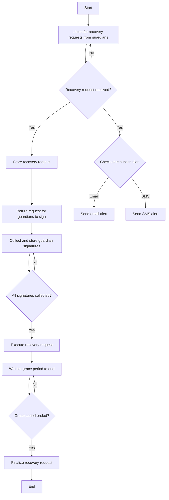

Secure Safe Accounts with a diverse set of recovery options like trusted contacts, email/SMS verification, Passkeys, secondary devices and more. 
Safe Recovery service has two main components: [Recovery UX](#recovery-ux-api) and [Email/SMS Recovery](#emailsms-recovery-api).

## Who is this for
Wallets using Safe [Social Recovery Module](/wallet/plugins/recovery-with-guardians/), and want to offer a seamless and secure recovery experience for their end-users.

## Recovery UX API

### Automatic Execution
The service offers automatic execution options to minimize UX friction and increase privacy for recovery contacts / guardians. 
It can be configured to automatically execute:

1. The confirmation recovery transaction after the signature threshold is met, eliminating the need for guardians to cover gas costs.
2. The finalization transaction after the grace period ends, avoiding recovery contacts to return back to complete the process.

### Signature Aggregation and Storage
Guardians signatures can be sent to the service to allow off-chain collection. The service can then automatically execute the recovery confirmation and finalization
once all required signatures have been collected.

### Gas Sponsorship Relayer
It includes a gas sponsorship relayer, which cover the gas costs for both confirmation and finalization

### Social Engineering protection
The api provides a communication system using emojis that enables guardians to verify and approve legitimate recovery requests, effectively preventing social phishing 
attempts by malicious actors who may try to manipulate the recovery process.

### Alerts and Notifications
Account owners can subscribe to receive notifications via email or SMS when a recovery request is initiated, whether onchain or through the service, ensuring they stay informed during a recovery process.
The service keeps track of transactions sent via the *Safe Recovery Module* and uses events and tracing to index transactions to send timely alerts.  

## Email/SMS Recovery API 

A secure and user-friendly solution that uses email and phone verification to facilitate account recovery. Can be used as a default recovery method or 
combined with other guardians (such as hardware wallets or trusted contacts) to create a customized recovery threshold. Features:

### Email Recovery
Supports both SMTP or OAuth2 based protocols. To verify user ownership of the email, a confirmation code is sent to the user's email, which they must enter to enable the guardian service.

### SMS Recovery
Supports SMS OTP. To verify user ownership of the phone number, a confirmation code is sent to the user, which they must enter to enable the guardian service.

### Multi-factor authentication
Supports MFA with different channels such as a combination of email and sms.

### Custom
Supports adding more channels like WhatsApp, Telegram and others. Please reach out to request the support of your selected channel. 

## How it works

## Reference Links

- [Recovery explainer](/blog/making-accounts-recoverable)
- [Module SDK](/wallet/plugins/recovery-with-guardians)
- [Module contracts and audits](https://github.com/candidelabs/candide-contracts)
- [Source code](https://github.com/candidelabs/safe-recovery-service)

