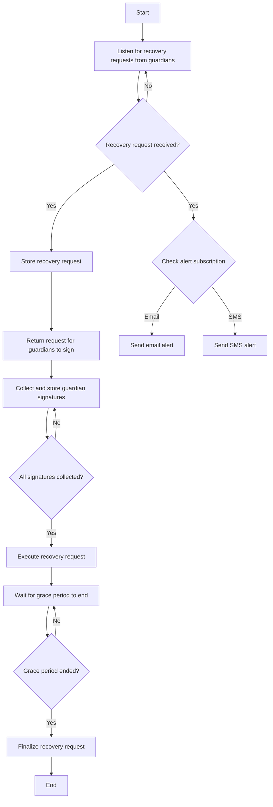

Secure Safe Accounts with diverse recovery options including trusted contacts, email/SMS verification, Passkeys, secondary devices, and more.
The Safe Recovery service consists of two main components: [Recovery UX](#recovery-ux-api) and [Email/SMS Recovery](#emailsms-recovery-api).

## Who is this for
Wallets implementing the Safe [Social Recovery Module](/wallet/plugins/recovery-with-guardians/) that want to provide a seamless and secure recovery experience for their end users.

## Recovery UX API

### Automatic Execution
The service provides automatic execution options to minimize UX friction and enhance privacy for recovery contacts and guardians.
Configure the service to automatically execute:

1. The recovery confirmation transaction once the signature threshold is met, eliminating the need for guardians to pay gas fees.
2. The recovery finalization transaction after the grace period expires, removing the need for recovery contacts to return and complete the process.

### Signature Aggregation and Storage
Guardian signatures can be submitted to the service for off-chain collection. Once all required signatures are collected, the service automatically executes the recovery confirmation and finalization.

### Gas Sponsorship Relayer
The service includes a gas sponsorship relayer that covers gas costs for both confirmation and finalization transactions.

### Social Engineering Protection
The API provides an emoji-based communication system that enables guardians to verify and approve legitimate recovery requests, effectively preventing social engineering attacks by malicious actors attempting to manipulate the recovery process.

### Alerts and Notifications
Account owners can subscribe to email or SMS notifications when a recovery request is initiated, whether onchain or through the service, ensuring they remain informed throughout the recovery process.
The service monitors transactions sent through the Safe Recovery Module, using events and tracing to index transactions and deliver timely alerts.  

## Email/SMS Recovery API

A secure and user-friendly solution that uses email and phone verification for account recovery. Use it as a standalone recovery method or combine it with other guardians (hardware wallets, trusted contacts) to create a customized recovery threshold. Features include:

### Email Recovery
Supports SMTP and OAuth2-based protocols. To verify email ownership, a confirmation code is sent to the user's email address. The user must enter this code to enable the guardian service.

### SMS Recovery
Supports SMS OTP verification. To verify phone number ownership, a confirmation code is sent to the user. The user must enter this code to enable the guardian service.

### Multi-Factor Authentication
Supports MFA across multiple channels, including combinations of email and SMS.

### Custom Channels
Supports additional channels including WhatsApp and Telegram. Contact us to request support for your preferred channel. 

## How it works

## Reference Links

- [Recovery explainer](/blog/making-accounts-recoverable)
- [Module SDK](/wallet/plugins/recovery-with-guardians)
- [Module contracts and audits](https://github.com/candidelabs/candide-contracts)
- [Source code](https://github.com/candidelabs/safe-recovery-service)

