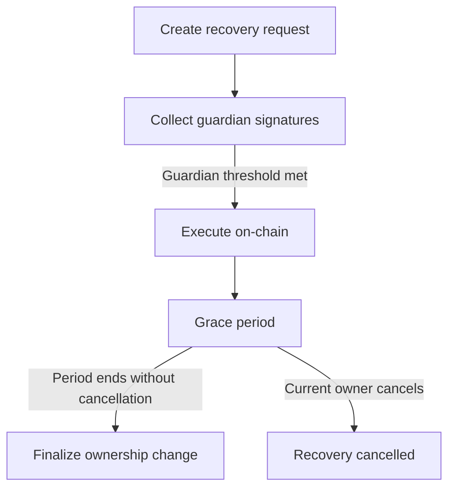

Candide's Safe Recovery Service helps wallets recover Safe accounts when users lose access to their signing keys. It works with the [Social Recovery Module](/wallet/plugins/recovery-with-guardians/), which lets trusted guardians approve new account owners through a signature threshold and a time delay.

The module enforces recovery rules on-chain. The service coordinates the process: collecting guardian signatures, submitting transactions, and notifying account owners.

## Who is this for

Wallet developers integrating the Social Recovery Module who want to automate recovery or offer email/SMS as a recovery method.

The service provides two APIs:

| API | Purpose |
|-----|---------|
| [Recovery UX API](#recovery-ux-api) | Coordinate recovery requests, collect signatures, sponsor transactions, and send alerts. |
| [Email/SMS Recovery API](#emailsms-recovery-api) | Let users authorize a service-managed guardian through email or phone verification. |

## Recovery UX API

Use this API to manage recovery requests approved by guardians, such as trusted contacts or hardware wallets.

### Signature Aggregation and Storage

The service collects and stores guardian signatures off-chain until the account's recovery threshold is met. For example, a 2-of-3 threshold requires approval from any two of the three guardians.

### Gas-Sponsored Execution and Finalization {#automatic-execution}

When enabled in the service configuration, the service submits and pays for two on-chain transactions on request:

1. **Execution:** Submit the approved recovery request once the guardian signature threshold is met. This starts the grace period.
2. **Finalization:** Complete the ownership change after the grace period ends.

Your application triggers each step by calling `/recoveries/execute` and `/recoveries/finalize`. The service does not submit them on its own. The gas sponsorship relayer covers the transaction costs, so guardians do not need to hold funds.

### Social Engineering Protection

Each recovery request has an emoji sequence that guardians can check with the account owner through a trusted communication channel before signing. This helps guardians identify the intended request and reduces the risk of approving a fraudulent one.

### Alerts and Notifications

Account owners can subscribe to email or SMS alerts for on-chain recovery activity. The service monitors Social Recovery Module events, so it detects executions, finalizations, and cancellations whether they were submitted through the service or directly on-chain. Alerts are not sent when a request is created off-chain; the first alert is sent once the request is executed on-chain.

See the [Recovery UX API reference](/wallet/recovery/ux-api/) for endpoints and request formats.

## Email/SMS Recovery API

Use this API to add a service-managed guardian that signs recovery requests after the user verifies their email address or phone number.

1. **Set up recovery:** While the user still has access to the account, register their email address or phone number, verify it with a one-time code, and add the returned guardian address to the Social Recovery Module.
2. **Authorize a recovery:** When the user needs to recover the account, verify a new one-time code to obtain the service-managed guardian's signature for the recovery request.

Email/SMS can be the sole recovery method or one guardian in a larger setup with trusted contacts or hardware wallets. The account's guardian threshold still determines how many approvals are needed.

The service also supports multi-factor authentication across channels, such as email and SMS. Contact us to request additional channels such as WhatsApp or Telegram.

See the [Email/SMS Recovery API reference](/wallet/recovery/auth-api/) for registration and recovery endpoints.

## How it works

Once guardians are configured, a successful recovery follows these steps:

1. **Create a request.** A guardian submits a signed recovery request specifying the proposed new owners and their signing threshold. The service stores the request off-chain.
2. **Collect approvals.** Guardians verify the request and submit signatures until the guardian threshold is met.
3. **Execute the request.** Your application submits the approved request on-chain through `/recoveries/execute`, starting the module's grace period. Subscribed account owners are alerted at this point.
4. **Wait through the grace period.** The current owner can cancel an unauthorized recovery if they still control the account.
5. **Finalize recovery.** After the grace period, your application calls `/recoveries/finalize`. Finalization replaces the account's owners and applies the new signing threshold.

```mermaid
flowchart TD
    A[Create recovery request] --> B[Collect guardian signatures]
    B -->|Guardian threshold met| C[Execute on-chain]
    C --> D[Grace period]
    D -->|Period ends without cancellation| E[Finalize ownership change]
    D -->|Current owner cancels| F[Recovery cancelled]
```

The service sponsors gas for execution and finalization when enabled in its configuration, but your application must trigger each step. **New owners gain control only after finalization.**

## Recovery Request States

The API's `status` field tracks progress through a successful recovery:

| State | Description |
|-------|-------------|
| `PENDING` | The request is stored and has not yet been executed. Guardian signatures can be collected. |
| `EXECUTION-IN-PROGRESS` | The guardian threshold is met and the execution transaction is being processed. |
| `EXECUTED` | The request has been executed on-chain. The grace period must end before finalization. Ownership has not changed. |
| `FINALIZATION-IN-PROGRESS` | The grace period has ended and the finalization transaction is being processed. |
| `FINALIZED` | Recovery is complete. The new owners and signing threshold are in effect. |

## Get Started

[Request service access](https://app.formbricks.com/s/brdzlw0t897cz3mxl3ausfb5), then follow the guide for your recovery method:

- **Personal guardians:** [Add a guardian](/wallet/plugins/how-to-add-a-guardian/), then follow the [Recovery Flow Guide](/wallet/plugins/recovery-flow-guide/).
- **Email/SMS:** [Enable email/SMS recovery](/wallet/plugins/add-candide-guardian/), then follow the [Email/SMS Recovery Flow](/wallet/plugins/recover-account-candide-guardian/).
- **Notifications:** Set up subscriptions with the [Recovery Alerts Guide](/wallet/plugins/recovery-alerts-guide/).
- **TypeScript integration:** Use the [Recovery Service SDK reference](/wallet/plugins/recovery-service-sdk-reference/).

## Reference Links

- [Recovery explainer](/blog/making-accounts-recoverable)
- [Social Recovery Module SDK reference](/wallet/plugins/recovery-module-reference/)
- [Module contracts and audits](https://github.com/candidelabs/candide-contracts)
- [Recovery Service source code](https://github.com/candidelabs/safe-recovery-service)
- [Recovery Service SDK source code](https://github.com/candidelabs/safe-recovery-service-sdk)
